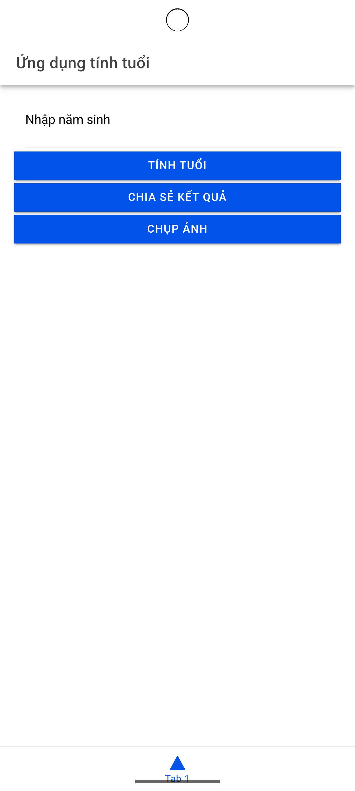
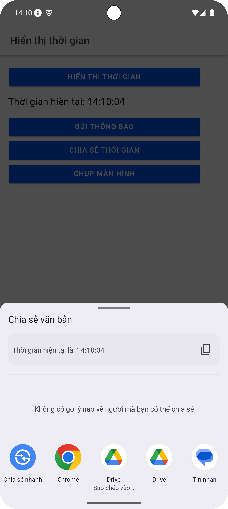
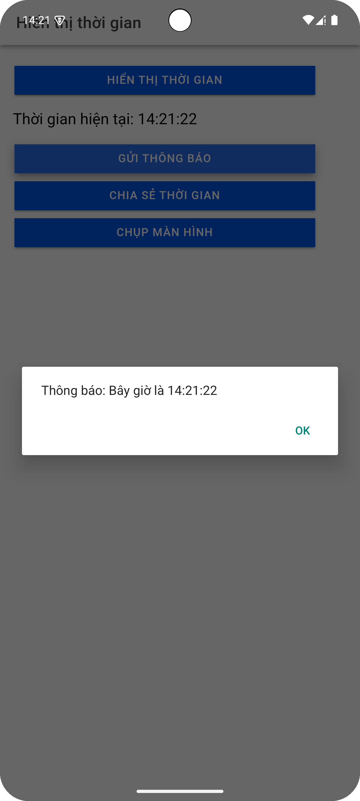
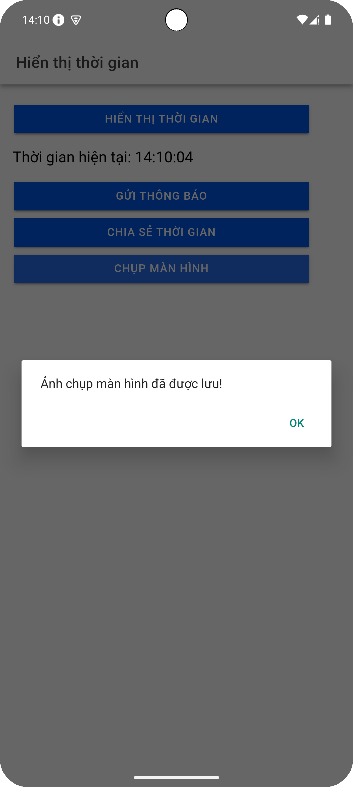

# Capacitor Time App

Ứng dụng hiển thị thời gian hiện tại, gửi thông báo cục bộ, chia sẻ thời gian và chụp màn hình bằng Capacitor và Ionic.

## 1. Cài đặt môi trường

### Yêu cầu:
- Node.js (>=16.x)
- Ionic CLI
- Capacitor CLI
- Android Studio (nếu chạy trên Android)
- Xcode (nếu chạy trên iOS)

### Cài đặt Ionic và Capacitor

```sh
npm install -g @ionic/cli
```

## 2. Khởi tạo và thiết lập dự án

### Bước 1: Tạo ứng dụng Ionic với Capacitor

```sh
ionic start myApp blank --type=angular
cd myApp
```

### Bước 2: Cài đặt Capacitor

```sh
ionic integrations enable capacitor
npm install @capacitor/core @capacitor/cli
```

### Bước 3: Cấu hình Capacitor

```sh
npx cap init myApp com.example.myapp
```

## 3. Cài đặt các Plugin Capacitor

```sh
npm install @capacitor/local-notifications @capacitor/share @capacitor/screen-capture
```

## 4. Chạy ứng dụng

### Chạy trên trình duyệt (chỉ dành cho kiểm tra giao diện, không hỗ trợ plugin Capacitor)

```sh
ionic serve
```

### Build và chạy trên thiết bị Android

```sh
ionic build
npx cap copy android
npx cap sync android
npx cap open android
```

Sau đó, nhấn **Run** trong Android Studio để chạy ứng dụng trên thiết bị thật hoặc giả lập.

### Build và chạy trên thiết bị iOS (MacOS + Xcode)

```sh
ionic build
npx cap copy ios
npx cap sync ios
npx cap open ios
```

Sau đó, chạy ứng dụng trong Xcode.

## 5. Các tính năng chính

- **Hiển thị thời gian:** Nhấn nút "Hiển thị thời gian" để cập nhật thời gian hiện tại.
- **Gửi thông báo:** Nhấn nút "Gửi thông báo" để hiển thị thông báo cục bộ với thời gian hiện tại.
- **Chia sẻ thời gian:** Nhấn nút "Chia sẻ thời gian" để chia sẻ thời gian hiện tại qua ứng dụng khác.
- **Chụp màn hình:** Nhấn nút "Chụp màn hình" để chụp và lưu ảnh màn hình.

## 6. Lưu ý
- Nếu thông báo cục bộ không hoạt động, hãy kiểm tra quyền trên thiết bị.
- Đối với iOS, cần bật quyền **Local Notifications** trong Xcode.

---

🚀 **Ứng dụng đã sẵn sàng để sử dụng!**

## 7. Ảnh chụp màn hình các tính năng






## 8. Ảnh chụp màn hình chạy trong Android Studio
.png)
.png)
.png)
